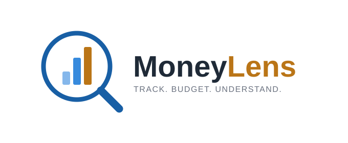

<p align="center">
  <picture>
    <source media="(prefers-color-scheme: dark)" srcset="brand-assets/logo/logo-dark.svg">
    
  </picture>
</p>
<p align="center"><strong>Track. Budget. Understand.</strong></p>

MoneyLens is a personal finance app for tracking transactions, budgets, and insights.

## Quick Start

```bash
cd apps/web-next
npm install
npm run dev
```

See [Getting Started](docs/getting-started.md) for the full setup guide.

## Documentation

- [Getting Started](docs/getting-started.md)
- [Deployment Docs](docs/deployment/release-howto.md)
- [Web App README](apps/web-next/README.MD)
- [API Docs](docs/api/bulk-upload.md)

## Project Structure

- `apps/web-next/` — Vite + React frontend
- `supabase/` — database schema, migrations, and tests
- `docs/` — deployment, API, and project documentation
- `brand-assets/` — logo and icon source files (SVG + PNG, light/dark variants)
